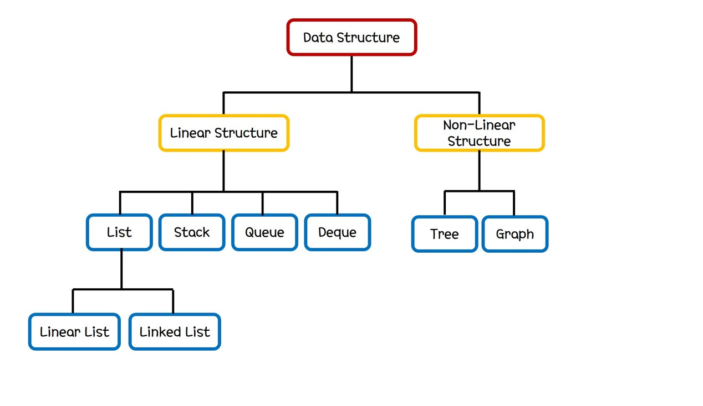

## Data Structure

자료구조는 프로그램 내에서 자료를 저장하는 여러가지 방법에 대해서 다루는 학문이다.
프로그램에 따라서 필요한 기능들이 다르기 때문에 해당하는 기능들을 효율적으로 구현할 수 있는 자료구조를 적절하게 선택해야 좋은 프로그램을 만들 수 있다.
이러한 맥락에서 자료구조에 대한 이해는 좋은 프로그램을 만드는데 큰 도움을 주며 그 만큼의 가치를 가진다.
본 문서에서는 자료구조의 종류와 각각의 간단한 특성들을 살펴볼 것이다.

## Overview

기본적인 자료구조의 분류는 아래와 같다. 

먼저 자료 구조는 선형구조(Linear Structure)와 비선형구조(Non-linear Structure)로 나누어진다.
선형구조와 비선형구조의 자료가 동일한 객체의 무방향성 나열성을 가지는가를 기준으로 나눌 수 있다.
선형구조의 경우, 뒤에서 설명할 list, stack, queue, deque와 같이 객체를 index와 같은 한 가지 가준으로 나열한 형태이다. 
비선형구조의 경우, tree, graph와 같이 hierarchy를 가지는 등 한 가지 기준에 의해 자료가 나열되지 않은 형태이다.

#### Linear Structure

앞서 설명한 것과 같이 선형구조는 list, stack, queue, deque를 포함한다. 이에 대한 간단한 설명은 다음과 같다.

- Linear List는 객체의 선형 나열이다. Array와 다른 점은 그 size가 정의한 순간 고정되지 않고 자유롭게 insert 및 delete가 가능하다는 점이다.
- Linked List또한 Linear List와 같이 객체의 선형 나열이다. Linear List와 다른 점은 객체를 정의할 때 배열을 쓰지 않고 node와 다음 node를 가리키는 pointer를 이용한다는 점이다.
- Stack은 자료를 추가하는 함수인 insert와 자료를 제거하는 함수인 pop이 존재하여, 가장 나중에 추가한 자료부터 제거되는 자료의 형태이다.
- Queue는 자료를 추가하는 함수인 queue와 자료를 제거하는 함수인 deque가 존재하여, 가장 먼저 추가한 자료부터 제거되는 자료의 형태이다.
- Deque는 자료를 추가하는 함수인 queue와 자료를 제거하는 함수인 deque가 존재하여, queue와 deque 모두 기존 자료의 양 끝 중 한 곳을 선택하여 추가 및 제거할 수 있는 자료의 형태이다.

#### Non-Linear Structure

앞서 설명한 것과 같이 비선형구조는 tree, graph를 포함한다. 이에 대한 간단한 설명은 다음과 같다.

- Tree는 자료의 hierarchical한 나열이다. Tree 내부의 각 자료는 parent와 child의 관계로 서로 연결되어 있다.
- Graph는 자료의 realational한 나열이다. Graph 내부의 각 자료는 서로에 대한 정보를 포함한다.
