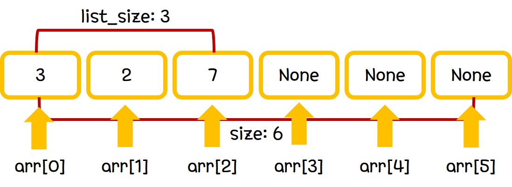

## Linear List

Linear List는 선형구조를 가지는 가장 기본적인 자료 형태이다.

Linear List의 ADT는 다음과 같다.

-  type arr[size]
-  int list_size
-  void insert(type element, int position)
-  void delete(type element, int position)
-  type get(int position)
-  int list_size()

위의 ADT에 따라 구현되는 자료의 시각적인 모습은 다음과 같다.

그림에서 보이는 바와 같이, linear list의 기본적인 자료구조는 size 크기의 array이다. 정의된 array 내부에서 자유롭게 공간을 할당하여 list를 구현할 수 있다.

공간을 할당하는 방법으로는 insert와 delete 함수가 존재한다.

insert 함수를 통해 지정한 위치에 원하는 element를 추가할 수 있고, delete 함수를 통해 지정한 위치의 element를 제거할 수 있다.
insert 함수를 통해 element가 추가되면 list_size를 1만큼 증가시켜 주어야하고, delete 함수를 통해 element가 제거되면 list_size를 1만큼 감소시켜 주어야한다.

당연하게도, 지정한 size 이상의 element를 할당할 순 없으며, 이를 원할 경우 array resizing 과정을 거쳐야 한다.
Resizing을 위한 방법으로는 할당량 초과가 나타난 순간 size를 상수만큼 늘리는 방법과 size를 상수배만큼 늘리는 방법이 주로 사용된다.

## Operation Complexity

Linear list에서 제공하는 함수는 insert와 delete, 그리고 list_size이다.

#### int list_size()

list의 size를 반환하는 함수이다.
private 변수인 list_size를 return해주면 된다.
> time complexity: O(1)

#### void insert(type element)

list의 가장 끝부분에 element를 추가하는 함수이다.
단순히 arr[list_size]에 element를 넣고 list_size를 1증가시키면 된다.
> time complexity: O(1)

#### void delete(type element)
list의 가장 끝부분의 element를 제거하는 함수이다.
list_size가 1이상인 경우에 대해 단순히 arr[list_size-1]에 element를 제거하고 list_size를 1감소시키면 된다.
> time complexity: O(1)

#### void insert(type element, int position)
list의 특정 index에 element를 추가하는 함수이다.
position부터 시작해서 그 이후의 값들을 한 칸 뒤(우측)로 이동시키고, element를 position index에 추가해주면 된다.
이전과 같이 list_size를 1 증가시키는 과정도 필요하다.
position의 randomness에 의해 값을 이동시키는 complexity가 O(n)이다.
> time complexity: O(n)

#### void delete(type element, int position)
list의 특정 index의 element를 삭제하는 함수이다.
position index 이후의 값들을 한 칸 앞(좌측)으로 이동시키면 된다.
이전과 같이 list_size를 1 감소시키는 과정도 필요하다.
position의 randomness에 의해 값을 이동시키는 complexity가 O(n)이다.
> time complexity: O(n)

#### type get(int position)
list의 특정 index의 값을 resturn하는 함수이다.
arr[position]에 접근하여 출력하면 된다.
> time complexity: O(1)
