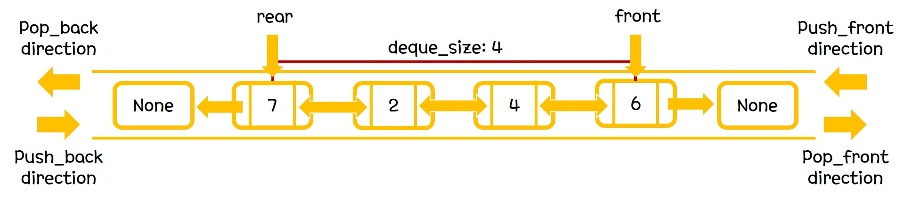

## Deque

Deque는 queue가 양쪽으로 존재하는 형태이다.
Deque를 구현하는 방법으로는 array-based, linked list-based가 존재하는데, 여기서는 linked list-based implementation에 대해서 다룬다.

Deque의 ADT는 다음과 같다.

-  dequeNode* front
-  dequeNode* rear
-  int queue_size
-  void push_back(type element)
-  void push_front(type element)
-  void pop_back()
-  void pop_front()
-  int deque_size()

위의 ADT에 따라 구현되는 자료의 시각적인 모습은 다음과 같다.

그림에서 보이는 바와 같이, deque의 기본적인 자료구조는 doubly linked list를 따른다.
Linked list와 다른 점은 자료의 추가 및 제거가 일관된 위치에서만 진행된다는 점이다.
공간을 할당하는 방법으로는 push_back, push_front와 pop_back, pop_front 함수가 존재한다.
push와 pop은 rear나 front 위치에서만 일어난다.

push_back 함수를 통해 deque의 rear쪽에 element를 추가할 수 있고,
push_front 함수를 통해 deque의 front쪽에 element를 추가할 수 있다.
pop_back 함수를 통해 dqeue의 rear쪽에 element를 제거할 수 있고,
pop_back 함수를 통해 dqeue의 front쪽에 element를 제거할 수 있다.
push 함수를 통해 element가 추가되면 deque_size를 1만큼 증가시켜 주어야하고, pop 함수를 통해 element가 제거되면 deque_size를 1만큼 감소시켜 주어야한다.

## Operation Complexity

Deque에서 제공하는 함수는 push_back, push_front, pop_back, pop_front 그리고 deque_size가 존재한다.

#### void push_back(type element)

deque의 rear에 element를 추가하는 함수이다.
새로운 dequeNode를 만들고 이 dequeNode의 nextNode가 기존 rear의 reference값을 가지도록, beforeNode가 None의 reference값을 가지도록 설정하면 된다.
rear가 push로 만들어진 queNode의 reference값을 가지도록 바꾸어준다.
마찬가지로 queue_size를 1증가시킨다.
> time complexity: O(1)

#### void push_front(type element)

dqeue의 front에 element를 추가하는 함수이다.
새로운 dequeNode를 만들고 이 dequeNode의 beforeNode가 기존 front의 reference값을 가지도록, nextNode가 None의 reference값을 가지도록 설정하면 된다.
front가 push로 만들어진 queNode의 reference값을 가지도록 바꾸어준다.
마찬가지로 queue_size를 1증가시킨다.
> time complexity: O(1)

#### void pop_back()

deque의 rear에 element를 제거하는 함수이다.
rear가 가리키는 Node를 None으로 바꾸어주면 된다.
rear를 기존 rear의 nextNode의 reference값으로 바꾸어준다.
마찬가지로 queue_size를 1감소시킨다.
> time complexity: O(1)

#### void pop_front()

deque의 front에 element를 제거하는 함수이다.
front가 가리키는 Node를 None으로 바꾸어주면 된다.
front를 기존 front의 beforeNode의 reference값으로 바꾸어준다.
마찬가지로 queue_size를 1감소시킨다.
> time complexity: O(1)

#### int deque_size()
deque의 size를 resturn하는 함수이다.
private 변수인 deque_size값을 return하면 된다.
> time complexity: O(1)
