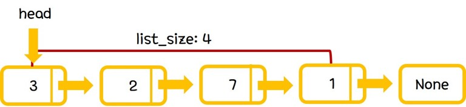

## Linked List

Linked List는 linear list를 발전시킨 선형구조 자료 형태이다.
Linear list와 다르게 element간의 연결을 이용해 list를 구현한다.
이 때 각 element는 Node라는 특별한 형태를 사용한다.

Node의 ADT는 다음과 같다.

- type data
- Node* nextNode

위의 ADT에서 data는 실제로 저장된 값의 정보이며, nextNode 는 다음 값이 저장되어 있는 Node의 주소를 가리키는 reference값이다.

Linked List의 ADT는 다음과 같다.

-  Node* head
-  Node* tail
-  int list_size
-  void insert(int position, type element)
-  void delete(int position)
-  type get(int position)
-  int list_size()

위의 ADT에 따라 구현되는 자료의 시각적인 모습은 다음과 같다.

그림에서 보이는 바와 같이, linear list의 기본적인 자료구조는 Node와 Node간의 연결관계를 나타내는 reference값들이다.
Node 하나당 값 하나를 포함하고 있기 때문에 Node를 추가, 제거 하면서 자유롭게 공간을 할당할 수 있다.

공간을 할당하는 방법으로는 push와 pop 함수가 존재한다.

insert 함수를 통해 linked list의 특정 index에 element를 추가할 수 있고, delet함수를 통해 linked list의 특정부분의 element를 제거할 수 있다.
insert 함수를 통해 element가 추가되면 list_size를 1만큼 증가시켜 주어야하고, delete 함수를 통해 element가 제거되면 list_size를 1만큼 감소시켜 주어야한다.

Linear list와 다르게 Node를 이용하여 array-based implementation이 아니기 때문에 resizing 과정이 불필요하다.

## Operation Complexity

Linear list에서 제공하는 함수는 insert, delete, get, 그리고 list_size가 존재한다.

#### void insert(int position, type element)

list의 가장 특정 index에 element를 추가하는 함수이다.
단순히 다음 새로운 Node를 만들고 head부터 position 근방까지 traverse한 후에, 기존의 position-1 위치의 nextNode를 새로 만든 Node의 reference값으로, 새로 만든 Node의 nextNode를 기존의 position 위치의 Node의 reference값으로 연결시켜 주면 된다.
기존에 하던 것과 같이 element가 추가되었으므로 list_size를 1증가시킨다.
Traverse 하는 과정 때문에 O(n)의 Time complexity를 가진다.
> time complexity: O(n)

#### void delete(type element)

list의 가장 특정 index에 element를 제거하는 함수이다.
head부터 position까지 traverse한 후에, 기존의 position-1 위치의 nextNode를 기존의 position+1 위치의 Node의 reference값으로 연결시켜 주면 된다.
이 때 의미 없는 값이 들어있는 제거된 Node는 dynamic memory free를 시켜주어야 한다.
기존에 하던 것과 같이 element가 제거되었으므로 list_size를 1감소시킨다.
Traverse 하는 과정 때문에 O(n)의 Time complexity를 가진다.
> time complexity: O(n)

#### type get(int position)
list의 특정 index에 element를 추출하는 함수이다.
head부터 position까지 traverse한 후에 그 Node에 들어있는 값을 return하면 된다.
Traverse 하는 과정 때문에 O(n)의 Time complexity를 가진다.
> time complexity: O(n)

#### int list_size()
list의 특정 index의 element를 삭제하는 함수이다.
position index 이후의 값들을 한 칸 앞(좌측)으로 이동시키면 된다.
이전과 같이 list_size를 1 감소시키는 과정도 필요하다.
position의 randomness에 의해 값을 이동시키는 complexity가 O(n)이다.
> time complexity: O(n)
