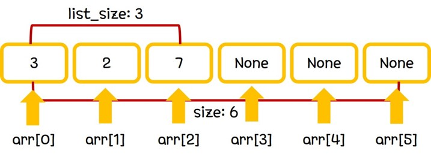

## Linear List

Linear List는 선형구조를 가지는 가장 기본적인 자료 형태이다.

Linear List의 ADT는 다음과 같다.

-  type arr[size]
-  int list_size
-  void insert(type element, int position)
-  void delete(type element, int position)
-  int list_size()

위의 ADT에 따라 구현되는 자료의 시각적인 모습은 다음과 같다.

그림에서 보이는 바와 같이, linear list의 기본적인 자료구조는 size 크기의 array이다. 정의된 array 내부에서 자유롭게 공간을 할당하여 list를 구현할 수 있다.

공간을 할당하는 방법으로는 insert와 delete 함수가 존재한다.

insert 함수를 통해 지정한 위치에 원하는 element를 추가할 수 있고, delete 함수를 통해 지정한 위치의 element를 제거할 수 있다.
insert 함수를 통해 element가 추가되면 list_size를 1만큼 증가시켜 주어야하고, delete 함수를 통해 element가 제거되면 list_size를 1만큼 감소시켜 주어야한다.

당연하게도, 지정한 size 이상의 element를 할당할 순 없으며, 이를 원할 경우 array resizing 과정을 거쳐야 한다.
Resizing을 위한 방법으로는 할당량 초과가 나타난 순간 size를 상수만큼 늘리는 방법과 size를 상수배만큼 늘리는 방법이 주로 사용된다.
