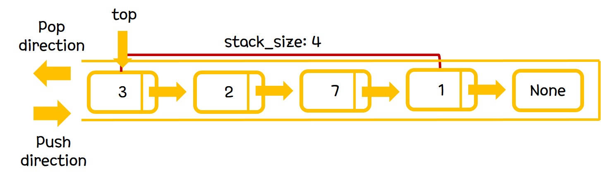

## Stack

Stack은 가장 나중에 들어간 자료가 가장 먼저 제거되는 형태의 LIFO(Last In First Out) type의 선형구조이다.
Stack를 구현하는 방법으로는 array-based, linked list-based가 존재하는데, 여기서는 linked list-based implementation에 대해서 다룬다.

Stack의 ADT는 다음과 같다.

-  stackNode* top
-  int queue_size
-  void push(type element)
-  void pop()
-  int stack_size()

위의 ADT에 따라 구현되는 자료의 시각적인 모습은 다음과 같다.

그림에서 보이는 바와 같이, stack의 기본적인 자료구조는 linked list를 따른다.
Linked list와 다른 점은 자료의 추가 및 제거가 일관된 위치에서만 진행된다는 점이다.
공간을 할당하는 방법으로는 push와 pop 함수가 존재한다.
push와 pop 모두 top쪽에서 나타난다.

push 함수를 통해 stack의 top쪽에 element를 추가할 수 있고, pop 함수를 통해 stack의 top쪽에 element를 제거할 수 있다.
push 함수를 통해 element가 추가되면 stack_size를 1만큼 증가시켜 주어야하고, pop 함수를 통해 element가 제거되면 stack_size를 1만큼 감소시켜 주어야한다.

## Operation Complexity

Stack에서 제공하는 함수는 push, pop, 그리고 stack_size가 존재한다.

#### void push(type element)

stack의 top에 element를 추가하는 함수이다.
새로운 stackNode를 만들고 이 stackNode의 nextNode가 기존 top의 reference값을 가지도록 설정하면 된다.
top이 push로 만들어진 stackNode의 reference값을 가지도록 바꾸어준다.
마찬가지로 stack_size를 1증가시킨다.
> time complexity: O(1)

#### void pop()

stack의 top에 element를 제거하는 함수이다.
top가 가리키는 Node를 기존 top의 nextNode로 바꾸어주면 된다.
마찬가지로 stack_size를 1감소시킨다.
> time complexity: O(1)

#### int queue_size()
stack의 size를 resturn하는 함수이다.
private 변수인 stack_size값을 return하면 된다.
> time complexity: O(1)
