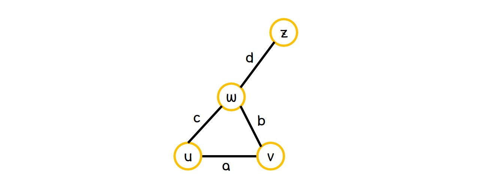

## Graph

Graph는 vertex와 edge로 구성된 자료구조이다.
```
G(V,E) is a graph defined with vertex set V and Edge set E
```

Graph를 구현하는 방법으로는 크게 3가지가 존재한다.
아래는 n개의 element를 가지는 vertex set과 m개의 element를 가지는 edge set에 대한 내용이다.
{: width="35%"}


#### Edge List

각각의 edge에 대해 각 edge를 구성하는 2개의 vertex와 해당하는 edge를 적어 저장하는 형태이다.
일반적인 형태는 다음과 같다.

{: width="40%"}


#### Adjacency List

각각의 vertex에 대해 인접한 vertex를 나열하여 자료를 저장하는 형태이다.
일반적인 형태는 다음과 같다.


{: width="55%"}

#### Adjacency Matrix

각각의 vertex가 행과 열로 나열되어있고, 그 vertex간의 연결관계가 사이에 적혀있는 형태이다.
연결되어있으면 1을 적어넣고, 연결되어 있지 않으면 0을 적어넣는다.
일반적인 형태는 다음과 같다.

{: width="55%"}

Graph를 이용하여 진행하는 것 중에 유명한 알고리즘으로 BFS와 DFS가 존재한다.
이에 대해서는 알고리즘에서 다루도록 한다.
