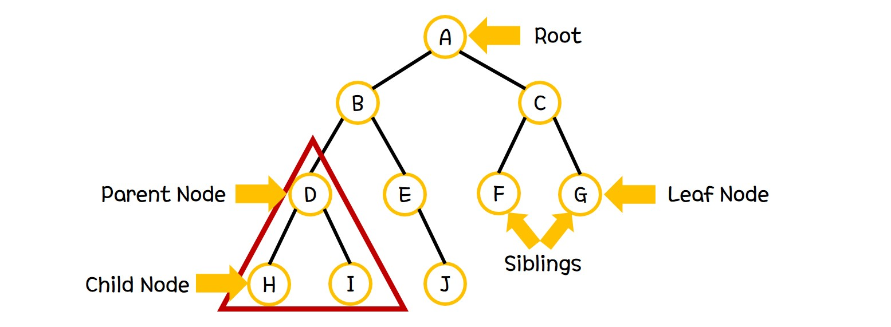

## Tree

Tree는 하나의 root node와 그 아래 연결되어있는 subtree로 이루어진 hierarchical한 자료구조이다.
일반적인 Tree의 형태는 다음과 같다.



아래는 Tree에서 사용하는 용어에 대한 정리이다.

- **Root**는 트리의 꼭대기에 있는 Node이다.
- **Parent Node**는 root로부터 가까워지는 방향으로 연결된 Node이다.
- **Child Node**는 root로부터 멀어지는 방향으로 연결된 Node이다.
- **Siblings**는 같은 Parent Node를 가지고 있는 두 Child 들의 집합이다.
- **Leaf Node**는 Child Node가 존재하지 않는 Node이다.
- **Ancestor**는 특정 Node로부터 parent의 관계로 연결되어 있는 모든 Node들의 집합이다.
- **Descendant**는 특정 Node로부터 child의 관계로 연결되어 있는 모든 Node들의 집합이다.
- **Subtree**는 한 Tree에 존재하는 모든 descendant의 집합이다.
- **Internal Node**는 적어도 하나의 child가 존재하는 Node이다.
- **External Node**는 child가 존재하지 않는 Node이다.
- **Degree**는 가장 많은 child를 가지는 Node의 child 수이다.
- **Depth**는 root에서 특정 Node까지의 경로길이이다.
- **Edge**는 Node 사이를 연결하는 간선이다.
- **Path**는 한 Node에서 다른 Node까지 가는 경로이다.
- **Level**은 leaf Node의 최대 depth이다.

Tree의 종류는 매우 다양하다.

Tree를 크게 두 가지로 나누면, Binary Tree와 B Tree로 나눌 수 있다.
Binary Tree는 그 안에서 Binary Search Tree, AVL Tree, Red-Black Tree, Heap 등으로 나눌 수 있다.

본 문서에서는 Binary Search Tree, AVL Tree, Red-Black Tree, Heap, B Tree에 대해서 다룰 것이다.

## Binary Tree

Binary Tree(이진 트리)는 parent node가 오직 0,1,2 개의 child node를 가지는 tree이다.
이는 다음과 같이 정의된다.

```
Binary Tree T is defined as
T = {} or
T = {root, T_l, T_r} where
    T_l, T_r are both Binary Tree
```

#### Binary Search Tree

Binary Tree는 Binary Search Tree, AVL Tree, Red-Black Tree, Heap으로 나눌 수 있다.
먼저, Binary Search Tree는 다음과 같이 정의된다.

```
Binary Search Tree T is defined as
T = {} or
T = {root, T_l, T_r} where
    for all node x in T_l, key(x) < key(r)
    for all node x in T_r, key(x) > key(r)
    T_l, T_r are both BST
```

정의에서 살펴볼 수 있듯이, Binary Search Tree는 특정 Node를 기준으로 
그 좌측에 존재하는 모든 descendent의 key값이 자신보다 작고,
우측에 존재하는 모든 descendent의 key값이 자신보다 큰 tree이다.

#### AVL Tree

AVL Tree를 정의하기 위해서는 balance factor인 bf를 정의할 필요가 있다.

```
For Node n and its left subtree T_l and right subtree T_r,
bf of n is defined as level(T_l) - level(T_r)
```

AVL Tree는 다음과 같이 정의된다.

```
AVL Tree T is defined as
T = {} or
T = {root, T_l, T_r} where
    abs(bf of root) < 1,
    T_l, T_r are both AVL Tree
```

#### Red-Black Tree

Red-Black Tree는 다음과 같이 정의된다.

```
Red-Black Tree T is defined as
T = {} or
Node of T is black or red.
Root Node of T is always black.
All leaf Nodes are black.
Red Nodes has always black child.
All paths from specific node to nodes which is leaf Node of tree with root of the specific node passes same number of black nodes.
```

#### Heap

Heap은 다음과 같이 정의된다.

```
Heap T is defined as
Complete Binary Search Tree
```

#### B Tree

B Tree는 다음과 같이 정의된다.

```
B Tree of order m is defined as Tree which have
internal nodes with key number equal with its number of children-1
all nodes with key number < m
all non-rooted internal nodes with children number equal or larger than ceil(m/2) and equal or smaller than m
```
